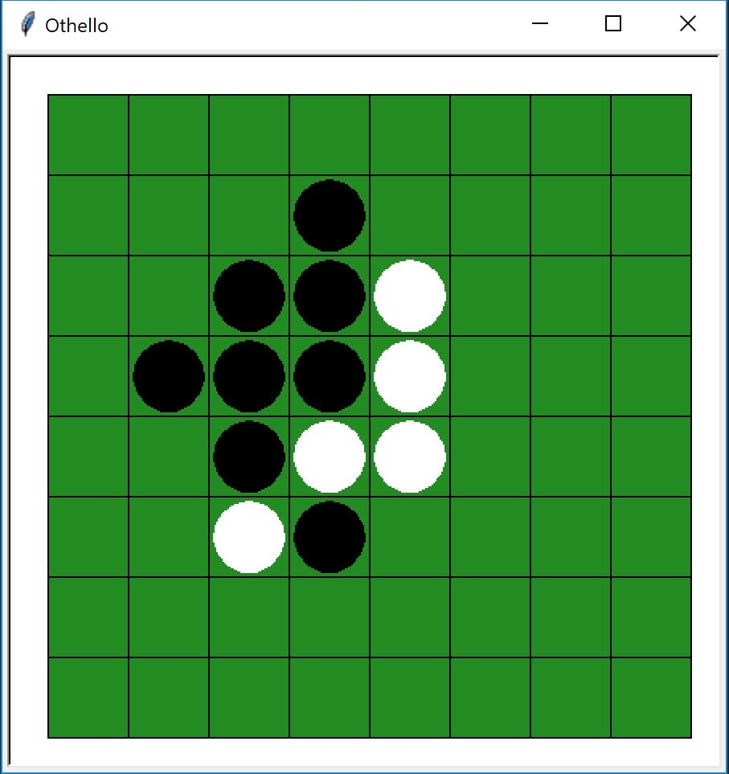

<h1> Welcome to Othello! </h1>
This is a fully playable game of Othello which allows you the opportunity to play with a friend or, if the computer is your friend, against the computer.

<h2>How to Run</h2>
To play, simply open "Driver.py" and run it. The game should appear and give you the option to choose a board size and whether you want to play against an AI or not.

<h2>Choosing a Board Size</h2>
To choose a board size, please enter a single even number greater than or equal to 4. The game will notify you if what you entered is invalid.

<h2>How to Play Othello</h2>
Othello is a 2-player game of black and white tiles. White goes first. The objective of the game is to have the most amount of your-colored tiles by the end of the game. You gain tiles of your color by sandwiching tiles of the opposite color. So here's an example:

|      |        |         |      |
| ---  |  ---   | ---    | ---  |
|   | **O** |    |    |
|**O**|  B  |  W  |   |
|   |  W  |  B  |**O**|
|   |     | **O** |   |

Any spot marked with a *O* is a valid move for White. 

**I hope you enjoy playing Othello!**
